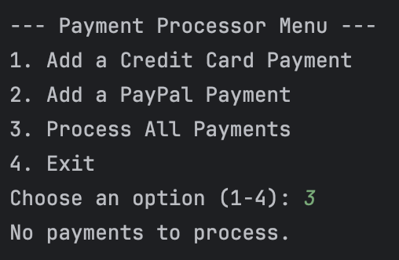

# TU-SWE-Payment-Processing-System
by Lorene Uy

This is a payment processing system.

These are the functionalities of the payment processing system:
1. Add a credit card payment.
   
2. Add a PayPal payment.
   
3. Process all payments.
   
- If there are no payments to process:
   
4. Exit.
   